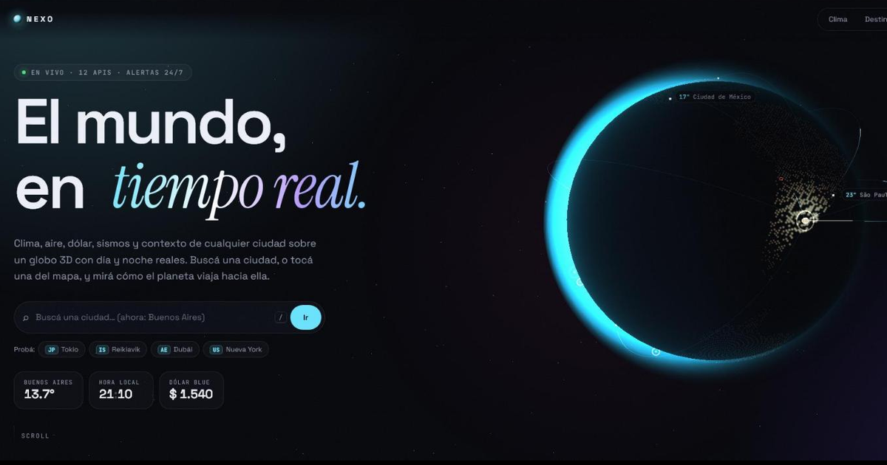

# NEXO · Panel de Integraciones

**[Ver en vivo →](https://fraqqqq.github.io/nexo-panel-integraciones/)**



Dashboard que integra **12 APIs** en tiempo real sobre un **globo 3D con shaders propios**, con **alertas 24/7 por Telegram** que corren en GitHub Actions (sin depender de que la pestaña esté abierta).

Proyecto de la materia *Integraciones Web*.

## Integraciones

| API | Dónde | Uso |
|---|---|---|
| [Open-Meteo Forecast](https://open-meteo.com) | Navegador + cron | Clima actual, 24 h, 7 días, amanecer/atardecer, pulso de 8 ciudades en **una sola request** |
| [Open-Meteo Geocoding](https://open-meteo.com/en/docs/geocoding-api) | Navegador | Autocompletado de ciudades |
| [Open-Meteo Air Quality](https://open-meteo.com/en/docs/air-quality-api) | Navegador | US AQI, PM2.5, PM10, ozono, índice UV |
| [DolarAPI](https://dolarapi.com) | Navegador + cron | Cotizaciones del dólar en Argentina |
| [ArgentinaDatos](https://argentinadatos.com) | Build | Historial de 30 días (snapshot de ~6 KB en vez de 3,5 MB) |
| [Frankfurter (BCE)](https://frankfurter.dev) | Navegador | Moneda local de la ciudad vs. USD, cruzada con el blue |
| [Banco Mundial](https://datahelpdesk.worldbank.org/knowledgebase/articles/889392) | Navegador | País: capital, región, población, PBI per cápita, esperanza de vida, internet |
| [Wikipedia REST](https://es.wikipedia.org/api/rest_v1/) | Navegador | Foto y resumen de la ciudad |
| [Nager.Date](https://date.nager.at) | Navegador | Próximos feriados del país |
| [USGS](https://earthquake.usgs.gov/earthquakes/feed/) | Navegador | Sismos M4.5+ de las últimas 24 h, dibujados en el globo |
| [GitHub REST](https://docs.github.com/rest) | Navegador | Estado de las últimas ejecuciones del cron de alertas |
| [Telegram Bot API](https://core.telegram.org/bots/api) | Cron | Envío de alertas |

## Arquitectura

```
                 ┌────────────── navegador ──────────────┐
 Open-Meteo ───▶ │ React + Three.js (globo GLSL)         │
 DolarAPI   ───▶ │ caché por ciudad · AbortController     │
 BCE/BM/Wiki ──▶ │ reintentos con backoff · CSP estricta  │
 USGS/Nager ───▶ └───────────────────────────────────────┘
                 ┌──────── GitHub Actions ────────┐
 Open-Meteo ───▶ │ alerts.yml  (cada 15 min)      │ ──▶ Telegram
 DolarAPI   ───▶ │ scripts/alerts.mjs + cache     │
                 └────────────────────────────────┘
                 ┌──────── build diario ──────────┐
 ArgentinaDatos ▶│ history.json (~6 KB)           │ ──▶ GitHub Pages
 máscara PNG ──▶ │ globe.bin (bitset, ~9 KB)      │
                 └────────────────────────────────┘
```

- **Alertas 24/7:** las reglas están en [`alerts.config.json`](alerts.config.json). El token del bot y el chat ID son *secrets* del repo y **nunca llegan al navegador**. Cada regla avisa una vez al dispararse y otra al volver a la normalidad; el estado persiste entre ejecuciones con `actions/cache`.
- **Datos precalculados en el build:** el historial del dólar se recorta a 30 días y la máscara de continentes se convierte en un bitset de 1 bit por punto.

## Lo visual

- Globo de 70 000 puntos (Fibonacci) con **día y noche reales** según la posición del sol, arcos de datos animados, etiquetas clickeables de 8 ciudades y **sismos que pulsan** según su magnitud.
- Toda la interfaz cambia de color según la temperatura de la ciudad; lluvia o nieve aparecen en la escena.
- Preloader que muestra las conexiones reales (con latencia), texto que se decodifica, cursor con anillo, botones magnéticos, tarjetas con inclinación 3D y luz que sigue al cursor, gráficos interactivos con mouse o teclado.

## Rendimiento

- **Calidad adaptativa:** mide los FPS al arrancar y, si el equipo no llega a 50, baja resolución, puntos y efectos.
- El render 3D se pausa fuera del hero; Three.js se carga con `lazy`.
- Sin `backdrop-filter` ni `mix-blend-mode` sobre contenido animado; las animaciones usan solo `transform`/`opacity`.
- Contadores animados que escriben directo en el DOM (cero re-renders de React por cuadro).
- Contexto de la ciudad (5 APIs) en paralelo, cancelado al cambiar de ciudad y cacheado 10 min.
- Medido: ~90 FPS en escritorio con el globo completo, sin tareas largas.

## Seguridad

- CSP estricta en producción: `script-src 'self'`, `connect-src` y `img-src` limitados a los dominios usados, `object-src 'none'`.
- Cero `innerHTML`; el texto que va a Telegram se escapa.
- Credenciales solo como *secrets* de GitHub Actions; el script nunca loguea la URL con el token.
- Validación de lo que se lee de `localStorage` y de la URL (`?ciudad=`).

## Calidad (CI)

Cada push corre **ESLint → TypeScript estricto → `npm audit` → build**, y solo si todo pasa se despliega a GitHub Pages. Un deploy diario refresca el historial del dólar.

## Correrlo

```bash
npm install
npm run dev          # genera globe.bin + history.json y levanta Vite
npm run build        # lint de tipos + build de producción
npm run alerts:dry   # simula el chequeo de alertas (sin secrets no envía nada)
```

### Activar las alertas en tu copia

1. En Telegram, hablá con **@BotFather** → `/newbot` y copiá el token.
2. Abrí tu bot y mandale `/start`.
3. En *Settings → Secrets and variables → Actions* creá `TELEGRAM_BOT_TOKEN` y `TELEGRAM_CHAT_ID`.
4. En *Actions → Alertas → Run workflow* tildá **prueba**: te llega un mensaje de confirmación.
5. Ajustá las reglas en `alerts.config.json`.

> GitHub pausa los workflows programados tras 60 días sin actividad en el repo; un commit los reactiva.

## Estructura

```
scripts/        build-globe.mjs · build-data.mjs · alerts.mjs (cron)
src/lib/        api.ts (clientes + reintentos) · useLive.ts · usePlaceInfo.ts · status.ts · format.ts · country.ts
src/components/ Scene.tsx (globo GLSL) · UI.tsx · Search.tsx · Preloader.tsx · Resilience.tsx
src/sections/   Weather · Destino · Dolar · System
```

## Créditos

Máscara de agua de [three-globe](https://github.com/vasturiano/three-globe) (MIT). Banderas de [flagcdn](https://flagcdn.com).
